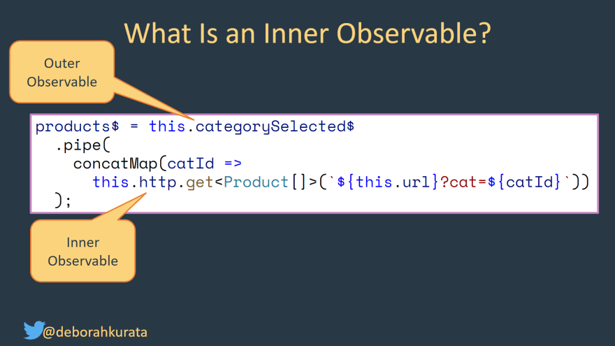

# RxJS

docs: https://rxjs.dev/guide/overview

## Observables


## Operators
### switchMap

Use switchMap when you want to map an emission to another observable and emit its emissions.
Ex: You have an observable of some id and want to emit the resource after fetching it:

```javascript
    user$ = Observable<User> = this.userId$.pipe(
    switchMap(id => this.service.getUser(id)),
);
```

When user$ is subscribed to, the user returned from service.getUser(id) is emitted (not the userId string).
